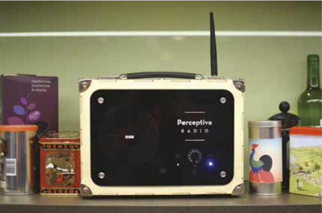
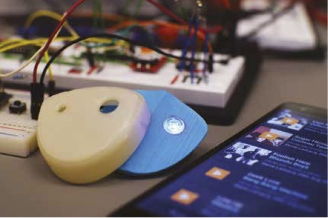
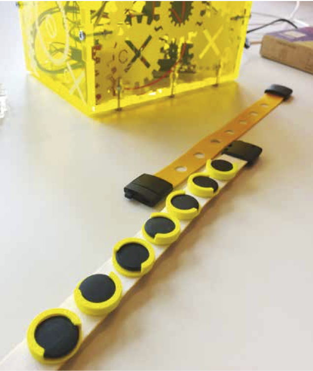

## BBC R&D
*Ian Forrester*
 
 
 
### Introduction

The future is here. Our lives have become intricately woven digital timelines. We used to listen to stories around the camp re, now we bask in the glow of the touchscreen. Online data transactions are the protagonists, and every gesture counts, steering this compelling and ever-shifting drama. Information is our currency, but we haven’t worked out the exchange rate, not yet harnessing the power of authoring our own digital storylines.

Like all the best technologies, the web can be used to both enlighten and enslave. This is the tale of two futures. One where we blindly offer ourselves as data-mines, serving and supporting a handful of towering economic machines, and transversely, where we inhabit a future of isolation, disconnected from services and struggling to navigate and share information.

How do we mediate them and shape an open Internet we actually want to exist? What role does media take? Where does a public service broadcaster  t in the vision of an open web?

There is a creeping sense within the upper echelons of the technology glitterati that soon everything we touch will turn to Internet gold, with an ‘Internet of Things’ blanket that connects all animate and inanimate objects (and maybe, just maybe, we’ll get those jet-packs we’ve been promised.) But it will happen. Of course we’ll falter at first and have to re-think the infrastructure, but it’s no joke to imagine our children living in connected homes, playing with toys that can identify them and read them bedtime stories. It seems we’re stumbling into this, without truly considering the ethical implications of making everyone and everything connected.

### Ian Forrester

Ian is a well-known and likeable character on the digital scene in the UK.
He has now made Manchester his home, where he works for the BBC’s R&D north lab. He focusses on open innovation and new disruptive opportunities via open engagement and collaborations with start-ups, early adopters and hackers.

His current research is into the area of Future Narrative and Storytelling. A new method of broadcasting, a technology he calls Perspective Media, pairs the best of broadcast with the best of the Internet to create an experience akin to sitting around a camp re telling stories. Interestingly, this also crosses over into the ‘Internet of Things.’

### Jasmine Cox
Jasmine is a Product Designer with BBC R&D’s user experience group in the North. With a background in Product Design from the University of Dundee, Jasmine has expertise across electronic, industrial, and mechanical design. She crafts playful devices and builds control systems to connect them to the Internet. Jasmine specialises in blending digital experiences with analogue interactions and objects. Her work with BBC R&D weaves together storytelling and tangible objects to enchanting effect.

### Perceptive Radio
Perceptive Radio combines the notion of the ‘Internet of Things’ with perceptive technology (sensing, insight and algorithms) to bring home good old-fashioned immersive storytelling. It is a networked object that can deliver tailored media experiences sympathetic to domestic environments, without being disruptive
or jarring.

Being a physical but networked object gives it presence, tangible and more real than a laptop playing the same content. The radio deceives by being an enchanted object in your home, watching and recognising the audience’s mood and reaction to content it plays. The changes are subtle and easily missed, rather than abrupt changes that would take the audience out of the immersion. The radio throws up a ton of interesting ethical questions while sitting there watching you.

### Playlister Fob
We’ve all been there; you hear an inspirational piece of music, a gem from Radio 6 Music - unlike anything you’ve heard before, or yet another classic comedy revelation on the R1 Breakfast Show. It’s a moment of broadcast you want to cherish forever, learn more about and share with friends. But you’re driving, or your hands are busy with the washing-up. You tell yourself to remember it, but by the time you get round to looking it up on your phone, it’s gone...

Radio has an implicitly active audience. It has natural advantages in that it’s live, personal and mobile, with strengths in the live experience, connectivity and topicality. However experiences with radio whilst driving are exclusively a one-way deal; 21 million people each week listen to the BBC in their vehicles, but can’t easily interact with their favourite station. Imagine that in one touch you could save that moment, simply and effectively, so you could access and share it later.

BBC R&D are developing Playlister Fobs, small, single-touch buttons that work with the BBC’s music service, Playlister, to save moments of broadcast. These fobs can be used when listening to any of the six networks currently served by BBC Playlister, on any live platform (FM, DAB, online streamed.)

Your Fob is a handy nomadic button; it can follow you wherever you go, ensuring you don’t need to  nd your phone to save that exceptional song.

This research will drive understanding of:
* The scope for media interactions beyond ‘the four screens’
* The utility of small control devices as connected products v app
* Linking older technologies (FM/ DAB Radio) with online content
* Connecting audiences to their beloved radio stations in new ways
* Further work into networked controllers and their role in our lives

### The Physical Playlist
The Physical Playlists machine is a physical-digital object that people would share with signi cant others and friends.

‘Mix tapes’ were a thing of love, a physical object people would share with important people in their lives. They were naturally a social object and highly representative of a person’s identity. The knowledge of the effort involved by the giver in selecting the songs and sitting through each one was also part of the symbolism for the receiver.

Objects can be generated from the media you ‘teach’ them, or existing objects shaped by how you play (embed) media into them. Thus the modern mix tape could become a linked series of small objects like lucky charms, physically shareable in forms representing the tracks they contain. The Physical Playlists Machine is based on the idea that physical items often mean more to us as physical beings and intends to add a level of exclusivity and personalisation to the sharing process. Considering trans-platform engagement and the ability to engage users and viewers in co-creating media, it is suggested that this may present as a new modality for user co-creation and curation. We now live in a world where when a young person
is asked how some technology works, they’re more likely to mistake the question for ‘how do I use it?’ We turn to teenagers to tell us how to use what are now everyday objects, without considering how this stuff got here, how it actually works, and what happens next. That’s why the world needs hackers. Every business needs hackers; every government needs hackers. Hackers learn through making, through exploring new technology, through repurposing.

*The Physical Playlist was designed with BBC R&D in collaboration with the AHRC Knowledge Exchange Hub The Creative Exchange.*

