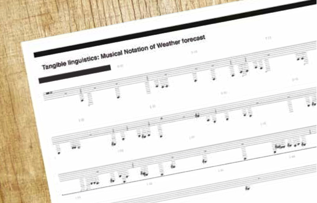

## Royal College of Art
*Natasha Trotman*
 
 
 
## Remixing Weather Forecasts
**Tangible Linguistics — Hearing with your Hands**

Remixing weather forecasts forms part of the Tangible Linguistics series, created whilst on the Information Experience Design course at the Royal College of Art. Tangible Linguistics explores how information can be experienced in more tactile/haptic ways and seeks to discover what is lost or gained when presented with a spoken description of the weather, which is then translated into musical notation, melody and vibrations through the playing of the notation. The aim of presenting weather data in this way is to encourage the visitor to engage with everyday information in a new way by using one of their other senses.

Tangible Linguistics examines whether experiencing linguistics/spoken information/ data in a ‘remixed’ format via other modes can transform a person’s experience and understanding of the data and is the basis for turning a weather forecast into a vibrational melodic object by extracting the data (sound/information) and turning this into a tactile/haptic experience.

This project seeks to question, explore and unpack our intangible, tangible relationship and experience of weather data, its new status as an object and the various tactile ways weather data can be experienced.

The motivation and purpose driving my projects is the creation of something that can be appreciated by all, irrespective of abilities or views. I look at ways to unpack, explore and use data in a tactile way; this is based on my research and understanding of the way data interfaces with our lives via multiple modes.

Essential sources of inspiration for me are the RCA IED department and the research and work of Csikszentmihalyi, Gustav Freytag, Zsofia Ruttkay and Sean Donahue. Much of my work exists in a number of formats, such as visual, physical and audio. The purpose of these multiple platforms is to explore and create various ways to encourage new experiences for the audience and users as well as initiate new conversations using various factors and multi-modal textures.

Tangible Linguistics seeks to understand, facilitate and participate in new ways of experiencing data and studies how people understand and relate to this data. This goal is undertaken via the exploration of tactile translations and representations of personal and public data via the illumination of topics and data sets within my project.
