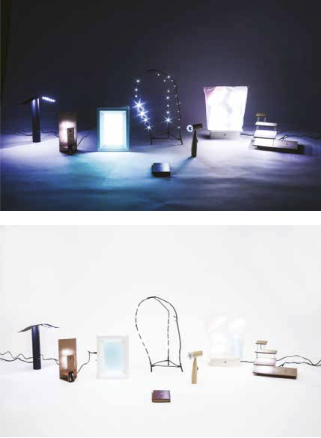

## Fabrica
*Dean Brown*
 
 
 
### Ruskin and The Maker Movement
The New Maker Movement bears close resemblance to the Arts and Crafts Movement (1860-1910), which was a reaction against industrialised manufacturing. They share the practice of decentralised making and the value of ‘hands-on’ craftsmanship.
The Arts and Crafts movement was influenced by the writings of John Ruskin, most notably his essays ‘The 7 lamps of Architecture’ (1849) and ‘The Stones of Venice’ (1851-53); both served as manifestos that outlined the values of craftsmanship. These lessons were guiding principles for how to make things well. The project intends to examine the enduring relevance of these principles in the context of the New Maker Movement.

### The 7 Lamps of Making
The 7 Lamps of Making re-visits John Ruskin’s essay ‘The 7 Lamps of Architecture’ (1849) as a guide for 21st century making - translating 19th century craft theory into a contemporary design project. Ruskin used the word ‘lamps’ to mean guides. These ‘lamps’ are objectified as tangible examples of the seven guides in practice - as critical objects that embody the enduring principles of good craftsmanship. Adopting the vocabulary of the Maker Movement, the project renders the principles relevant to makers now - using readily available democratic tools and materials such as 3D printing, LED lighting, laser cutters and kit electronics. ‘The 7 Lamps of Making’ places the New Maker Movement in historical context, recognising and disseminating the relevant craft values that have, and remain, necessary to make things of quality.

www.7lamps.info
