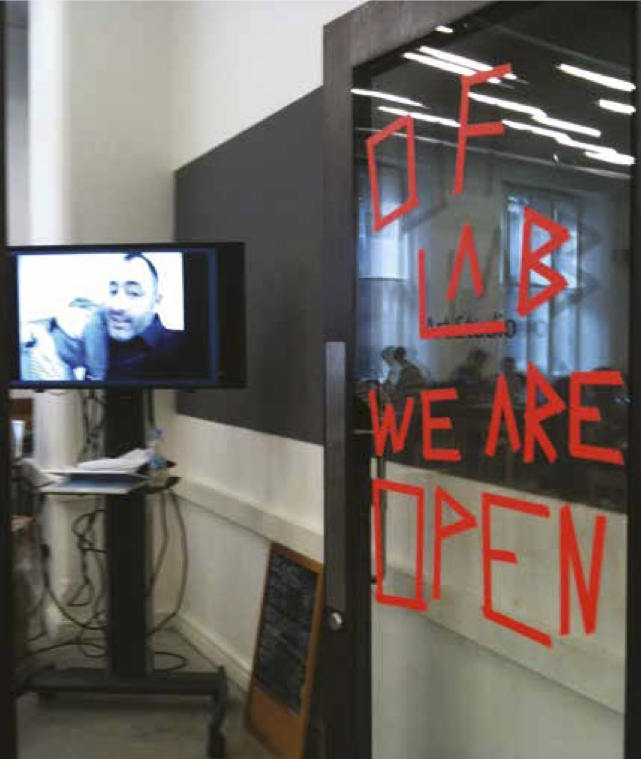
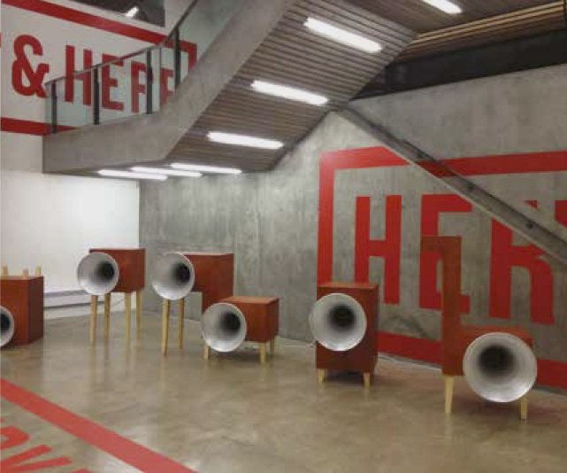
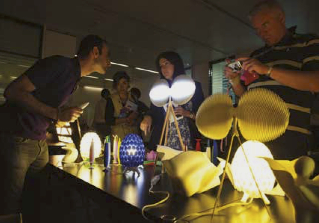
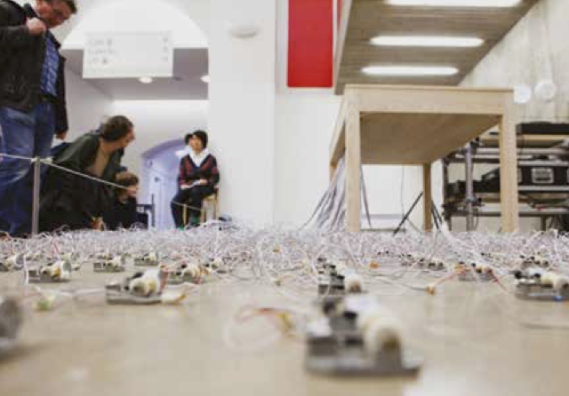

  
*openFrameworks Lab, Hellicar & Lewis, V&A Digital Design Week (2010) An open workshop by Hellicar&Lewis and programmers from the openFrameworks community developing interactive coding projects.  Photo by Irini Papadimitriou ©*

## V&A
*Irini Papadimitriou*
 
 
 
### Digital Design Weekend: We Are Open
*openFrameworks Lab: We are Open*

A DIY door sign made from coloured tape welcomes visitors to a studio buzzing with people busily working on a series of projects ranging from human computer interaction, low cost computing to computer vision and more. The event, an open workshop with programmers from the openFrameworks community, artists Hellicar&Lewis, hackers, designers, students, teachers, and the general public, was part of the V&A’s first Digital Design Weekend in September 2010.

A few weeks earlier, an open call had been circulated to communities of programmers to join the event at the V&A and work collaboratively with each other and the public. The challenge was to develop a series of interactive coding projects over the weekend with input from museum visitors. The response to the open call was overwhelming. Over 50 people, including designers and technologists from across Europe and the United States, joined in a weekend of co-creating, great coffee and the opportunity to meet like minded people. Their discussions and creative exchange went on to continue long after the event ended.

The pilot Digital Design Weekend followed the V&A’s exhibition Decode: Digital Design Sensations opened at the V&A. Decode presented the latest developments in digital and interactive design, from small screenbased graphics to large scale interactive installations and works by established international artists and designers. Decode offered the Digital Programmes team a new opportunity to bring in a diverse community of artists and designers and involve them in our programmes; from public workshops and activities for kids, to large scale events such as the Digital Design Weekend.

Since the team was formed in 2008, the aim of our work has been to engage visitors of all ages in a range of activities and events that promote innovative digital art, design practices, collaborative processes, inspire creativity and stimulate discussion. We wanted to engage audiences creatively and critically with technology used digital art and design and provide opportunities for the public to meet practitioners,
whilst also enabling them to explore, learn and be creative with technology.

It was through Decode that we found the opportunity to start engaging digital artists and designers, people like Karsten Schmidt, a computational designer and an early contributor to the Processing.org project who merges code, design, art & craft skills ; engineer, musician and hacker Memo Akten; Hellicar&Lewis, founded in 2008 by Pete Hellicar and Joel Gethin Lewis with the express aim of building a creative business around open source and Tinker London, a multidisciplinary design studio that ran from May 2007 to December 2010.
Those and many more took part in our activities to unselfishly share their knowledge and skills with the public. With these programmes we wanted to demystify technology and media by revealing its design processes and empowering visitors to be makers and not just consumers. We wanted to not only bring the work of all these innovators to the attention of the public, but also to enable visitors to be part of it.

That door sign from the early days, openFrameworks Lab: We are Open, sums up in a few words what the Digital Design Weekend is all about and what it aims to bring to the Museum.

The Digital Design Weekend was introduced in order to create open dialogue between artists, designers and audiences. Coinciding with the London Design Festival at the V&A, the event aims to explore and promote contemporary digital art and design and present cutting edge work and research projects, giving audiences the opportunity to meet the practitioners and find out more about processes, engaging in dialogue, debate and the creation of culture.

The Digital Design Weekend’s purpose was to transform the Museum into one big workshop. While we have always been interested in showcasing the latest developments in digital and interactive design, offering opportunities for the public to see ‘show and tell’ presentations of new projects and to meet practitioners who explore intersections of craft, technology and science, the main focus has not been in presenting  finished pieces. On the contrary, the Digital Design Weekend looks mainly at ideas, processes and work under development. Studios and galleries become makerspaces, tinkerspaces or labs, where visitors come together with artists and designers to discuss and think about objects, making and working collaboratively.

While the Digital Design Weekend was growing bigger every year, it was soon realised that all these partnerships and collaborations taking place around and during the event needed a more regular forum to develop and grow. A big annual event like this was a powerful way to bring so many people together, but how were we to sustain all these discussions, partnerships, collaborations and creative exchange that had started taking place?

Then a new programme, Digital Futures, began in May 2012 as a series of informal meet-ups. Digital Futures started as an open studio showcase for sustaining collaborations and links with universities, offering opportunities to students and researchers from digital media, computational, interactive arts & digital design courses to share, show and discuss their work with fellow researchers, professionals and the public. Besides being a chance to bring academic work and research to the public, it was also a flexible and open space for people to meet, network, present and share innovative projects, as well as a platform for nurturing discussion and future collaborations between those taking part.

Considering the unusual challenges of working within a museum space, it was a great advantage to be able to have an open event where participants could turn up with prototypes and pop up installations to share. The programme has come to include workshops and round-table discussions, talks, feedback sessions alongside showcases which give participants the chance to show their work
in a national museum.

Digital Futures has developed into regular monthly meet-ups that reach universities across London and beyond. That is not to say it is only an event for students.
As a platform for sharing, exchange and networking, this programme is particularly focused on collaborative practices and cross disciplinary work, and it aims to engage in a dialogue with academic institutions and creative industries. We are interested in exploring technology’s role in connecting art, science, design, crafts and more, but also in creating a space for co-producing, sharing, distributing and supporting emerging artists, designers & start-ups which build links with industry.

Maker culture, DIY media, physicality and technology, human-machine interaction and environment are some of the first ideas we started exploring early on at the Digital Design Weekend. In 2012, the Digital Design Weekend’s theme of gesture and communication coincided with the Alan Turing Centenary and included work by a number of artists, from early digital art pioneers held in the V&A’s computer arts collection, to emerging contemporaries investigating his enduring influence on art and contemporary culture. Then, last year’s event looked at collaborations between Art, Design & Science; how art and design can give a new perspectives on scientific endeavours and how scientific developments influence and inspire works of art
in new media.

One of the highlights of 2013 was a climate change and fashion hackathon led jointly by the Met Office, Centre for Sustainable Fashion, University of Dundee and Falmouth University. This open, public hackathon brought together a group of brilliant people who worked collaboratively over the weekend, working across disciplines and developing projects, some of which are still ongoing and being displayed internationally.

That hackathon was the result of some earlier partnerships and joint events with the Met Office and University of Dundee at Digital Futures sessions. And coming to 2014, Open Collaborative Making would not have happened without these earlier collaborations. It is a great pleasure to welcome back partners like the Met Office and University of Dundee, but also it is another exciting occasion for bringing on board new people and organisations. This year we will be inviting participants and audiences to explore digital value, cultural value and ‘making’ value.

The programme includes projects such as Heidi Hinder’s Money No Object, which explores a new significance for material and physical currencies in an increasingly immaterial digital world, one where smart payment transactions are imperceptible, but human emotions, creativity and culture retain a value that money can’t buy.
Or, Knyttan, sharing tools for pioneering the democratisation of manufacturing, the Restart Project helping people understand the impact of electronic waste and how to negate it and Flora Bowden and Dan Lockton’s Drawing Energy & Powerchord that explores energy use and everyday life, investigating and communicating data in meaningful ways.

We are again inviting people to join in a weekend of working, playing, collaborating, networking and sharing knowledge, tools, practice to encourage experimentation and for another year we want to engage people with the processes of design and making through provocative and surprising means.

The possibilities opened by the maker movement, desktop fabrication tools and new technologies allow for new alliances, remixes, resistance and the power to reclaim culture. From this, the future of cottage industries and independent fabrication are generating new economies led by inventors and entrepreneurs operating on their own terms.

At the same time environmental, economic challenges and the increasing scarcity of resources have become central to work by designers, artists and scientists, who are looking to innovative materials and processes as well as sustainable approaches to making and production. Can these concerns lead to easier and stronger collaborations where skills and resources are shared? Maker and DIY culture is not only contributing to innovation, but is also having a significant effect on education, communities and industry. Museums and other cultural organisations can have an active role opening up discussions about our future and the impact of technologies, setting the ground for activities that bring people together, enabling such collaborations and promoting peer production and skill-sharing. By opening their doors to experimentation and collective making, encouraging communities and people to create and participate, question and not passively consume, museums can nurture the inventors and entrepreneurs of the future.

*Irini Papadimitriou, Digital Programmes Manager.*

  
*Garden of Russolo, Yuri Suzuki, V&A Digital Design Weekend (2013)  Interactive installation of voice activated sound works ‘White Noise Machines’, inspired by Futurist composer Luigi Russolo’s Intonarumori.   Photo by Victoria and Albert Museum, London ©*

  
*Assa Ashuach Studio, V&A Digital Design Weekend (2011)  
Assa Ashuach’s unique 3D interactive software allows people to modify or co-design his products and manufacture them on demand.  
Photo by Victoria and Albert Museum, London ©*

  
*Musical Table, Kouichi Okamoto, V&A Digital Design Weekend (2012)  A multitude of musical boxes wired up to a table that responds to the movements of visitors.  Photo by Victoria and Albert Museum, London ©*  
